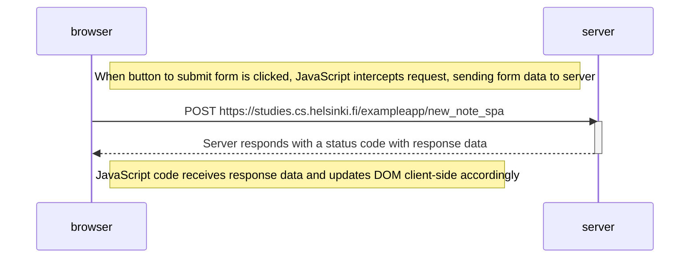

```mermaid

sequenceDiagram
    participant browser
    participant server

    Note right of browser: When button to submit form is clicked, JavaScript intercepts request, sending form data to server
    browser->>server: POST https://studies.cs.helsinki.fi/exampleapp/new_note_spa
    activate server
    server-->>browser: Server responds with a status code with response data
    deactivate server

    Note right of browser: JavaScript code receives response data and updates DOM client-side accordingly

```